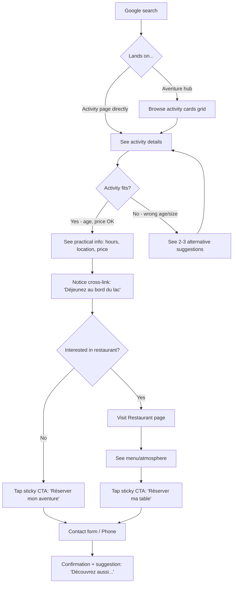
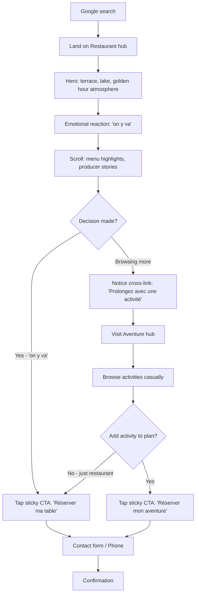
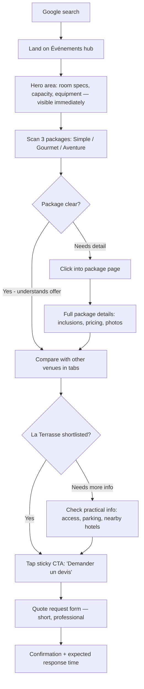
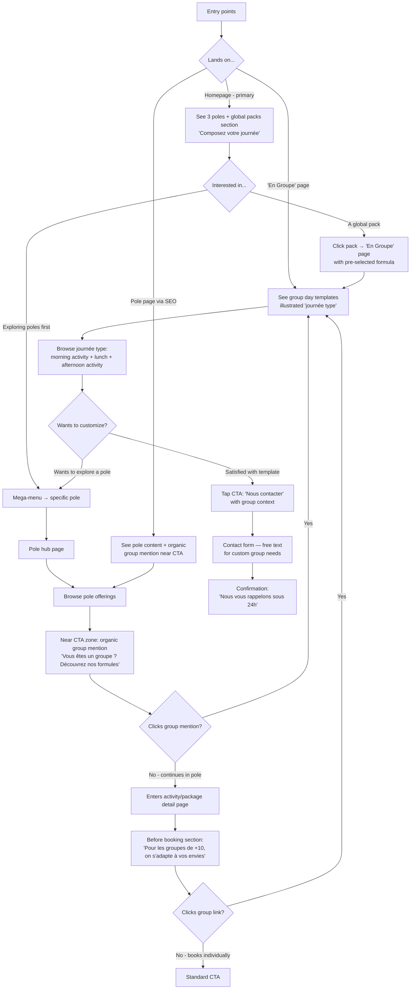

# UX Design Specification base-de-loisir-saint-ferreol

**Author:** Corentin
**Date:** 2026-03-09

---

<!-- UX design content will be appended sequentially through collaborative workflow steps -->

## Executive Summary

### Project Vision

La Terrasse Saint-Ferréol is a multi-service leisure base website serving as the digital front door for three interconnected poles — Restaurant, Aventure, and Événements — at the landmark Lac de Saint-Ferréol near Toulouse. The UX strategy centers on the principle "the place is the product": Saint-Ferréol's exceptional setting is the narrative anchor that unifies three distinct service identities under one brand. The site exploits a quality gap in the leisure base sector, where competitors have outdated, utilitarian websites. Each page functions as an autonomous SEO landing page while a double-layer cross-linking system ensures visitors discover complementary services.

### Target Users

**Primary personas:**

- **Sophie (Family Organizer, 30-45):** Searches for outdoor family activities, arrives via SEO on activity pages. Needs age-appropriate filtering, price visibility, and meal options. Decision: practical + emotional.
- **Marc & Léa (Casual Couple, 25-40):** Searches for lakeside dining, decision driven by atmosphere before menu. The setting sells the experience. Discovery of activities is a bonus.
- **Laurent (Corporate Planner, 35-55):** Searches for seminar venues near Toulouse. Needs specs immediately (room capacity, equipment, pricing). Compares 3-5 venues, decides fast. Three named packages (Simple/Gourmet/Aventure) over complex configurators.
- **Karine (Group Organizer, 40-60):** Needs all three poles simultaneously for group outings. Breaks the silo architecture — reveals the need for transversal pages and homepage as cross-pole hub.

**Secondary users:** Young adults (18-25, price-sensitive), school groups, retirees, site operator (CMS admin).

**Device context:** Majority mobile (leisure searches). Desktop for corporate planners comparing venues.

### Key Design Challenges

1. **Multi-entry navigation clarity:** 3 poles + 3 transversal pages + 10+ activity sub-pages must be navigable without confusion, especially on mobile with a slide-out mega-menu panel.
2. **Cross-selling without overload:** Double-layer system (structural "La Terrasse c'est aussi..." + contextual narrative suggestions) must educate without feeling commercial. Narrative tone is critical.
3. **Three visual identities, one brand:** Each pole shifts color and emotional tone (brun terre/warm, vert végétal/dynamic, bleu ardoise/professional) while maintaining La Terrasse coherence. Pole transitions must feel intentional, not jarring.
4. **Cross-pole user journeys:** Visitors with transversal needs (groups, families) must navigate between poles frictionlessly. Homepage and transversal pages serve as their entry points.

### Design Opportunities

1. **"Journée type" immersive timeline:** A creative centerpiece section (potential for GSAP/scroll-driven animation) that shows a full day at La Terrasse — the signature design moment (the 10% immersive in a 90% sober site).
2. **Smart activity alternatives:** When an activity doesn't fit (age, group size, weather), contextual suggestions retain the visitor instead of losing them — a UX pattern rarely seen on competitor sites.
3. **Location-first emotional funnel:** By leading with Saint-Ferréol's beauty before any service description, every page follows the pattern: want to be there → want to do something → take action. This leverages an uncopiable competitive advantage.

## Core User Experience

### Defining Experience

There is no single "core action" — the site serves equally critical scenarios with equal priority:

- **Discovery & browsing** (Sophie/families): Find activities, check prices/age suitability, combine with meal
- **Emotional decision** (Marc & Léa/couples): Feel the atmosphere, decide "on y va" before reading details
- **Specs & quote** (Laurent/corporate): Assess venue capacity, compare packages, request quote in under 3 minutes
- **Cross-pole planning** (Karine/groups): Navigate across all three poles to assemble a full-day program

The UX must serve all four journeys with equal fluency. No persona is secondary.

### Platform Strategy

- **Mobile-first design:** Families and couples search on mobile (leisure search behavior). All interactions must be thumb-friendly and fast on 4G.
- **Desktop excellence for corporate:** Laurent compares venues on desktop — the Événements pages and quote flow must feel professional and spec-rich on larger screens.
- **No offline requirement** for V1.
- **Touch-optimized navigation:** Swipe-friendly activity browsing, tap-to-expand cards, smooth transitions between poles.

### Effortless Interactions

Navigation fluidity is the defining UX quality — at every level of the hierarchy:

1. **Hub → Pole switching:** From homepage or any hub, reaching any pole must be instant (mega-menu + visible pole entry points).
2. **Intra-pole browsing:** Within Aventure, navigating from Paddle → Pédalo → Canoë must feel like flipping through cards, not loading separate pages. Lateral navigation between related activities.
3. **Cross-pole discovery:** From an activity page, contextual narrative links ("Après votre paddle, déjeunez au bord du lac") create natural bridges without forcing the user back to a hub.
4. **Return to overview:** At any depth (e.g., activity detail page), the user can instantly return to the pole hub or homepage without disorientation.

### Critical Success Moments

1. **The reveal (first 3 seconds):** Logo mask on brun-terre background with zoom animation that unveils the site — immediately signals this is not a generic leisure base website. Sets quality expectations.
2. **The hero impact (first scroll):** Full-screen video hero of Lac de Saint-Ferréol. The visitor feels "I want to be there" before reading a single word. This is where the emotional funnel begins.
3. **Activity match (within 30 seconds):** Sophie finds an activity that works for her family's ages and budget, sees alternatives if it doesn't fit, and notices she can eat on-site. Retention happens here.
4. **Specs confidence (within 60 seconds):** Laurent lands on Événements, sees room capacity and equipment specs in the hero area, and understands the three packages without scrolling. Professional credibility established.

### Experience Principles

1. **Every page is a front door:** Each page must work as a standalone landing from Google — self-contained context, clear value proposition, obvious next action.
2. **Lateral over vertical:** Users should move sideways (between activities, between poles) as easily as they scroll down. Navigation is horizontal discovery, not just linear consumption.
3. **The place sells first:** Saint-Ferréol and the lake appear before any service description. Emotional pull precedes information architecture.
4. **90% sober, 10% immersive:** One design moment per page (the hero). Everything else is clean, fast, and functional. The logo-mask reveal and "journée type" timeline are the signature creative expressions.
5. **Clarity over choice:** Few options, well-named, immediately understandable. Three seminar packages, not five. Activity cards with key info visible, not hidden behind clicks.

## Desired Emotional Response

### Primary Emotional Goals

The dominant emotional response across the entire site is **anticipation and wonder**: "This looks incredible, I can't wait to be there." Every design decision serves this feeling — from the logo-mask reveal to the video hero to the activity cards. The site doesn't inform first; it makes you want to come first.

**Per-pole emotional tones:**

- **Restaurant (brun terre):** Warmth, conviviality, sensory desire — "I'm already hungry." Evokes the feeling of a long lunch on a terrace overlooking a lake. Contemplative, slow-paced, indulgent.
- **Aventure (vert végétal):** Energy, excitement, playfulness — "This is going to be fun." Evokes the thrill of being outdoors, active, with family or friends. Dynamic, upbeat, accessible.
- **Événements (bleu ardoise):** Confidence, professionalism, reassurance — "This is the right place." Evokes trust in a well-equipped venue with a unique setting. Sober, competent, premium.

### Emotional Journey Mapping

| Stage | Emotion | Design Driver |
|-------|---------|---------------|
| **First contact (0-3s)** | Intrigue, quality signal | Logo-mask reveal animation on brun-terre — "this is different" |
| **Hero impact (3-10s)** | Wonder, desire to be there | Full-screen video of Lac de Saint-Ferréol — "it looks incredible" |
| **Exploration (10-60s)** | Discovery, excitement | Three poles revealed as interconnected experiences — "there's so much to do" |
| **Deep dive (1-3min)** | Confidence, clarity | Activity details, prices, specs immediately visible — "I know exactly what to expect" |
| **Decision (2-5min)** | Anticipation, readiness | Clear CTA, easy contact — "I can't wait, let's go" |
| **Dead end / mismatch** | Curiosity, not frustration | Smart alternatives and cross-pole suggestions — "oh but there's this too" |

### Micro-Emotions

**Critical positive micro-emotions to cultivate:**

- **Confidence over confusion:** Navigation is always clear. User always knows where they are and how to get elsewhere.
- **Excitement over anxiety:** Prices visible, no hidden costs, practical info upfront. No "call for pricing" dread.
- **Delight over mere satisfaction:** Small design details (smooth transitions, beautiful photography, subtle animations) signal care and quality.
- **Trust over skepticism:** Professional presentation for Événements, real producer stories for Restaurant, honest activity descriptions for Aventure.

**Negative emotions to prevent:**

- **Frustration from dead ends:** If an activity doesn't fit (age, group size, season), alternatives are immediately visible.
- **Overwhelm from too many choices:** Maximum 3 seminar packages, clear activity categories, no configuration complexity.
- **Disconnection between poles:** Transitions between pole visual identities must feel like entering a new room in the same house, not a different website.

### Design Implications

| Emotional Goal | UX Design Approach |
|---------------|-------------------|
| Wonder / "I want to be there" | Location-first heroes, video, high-quality photography of the lake and surroundings |
| Anticipation / "Can't wait" | Immersive "journée type" timeline showing a full day — makes the experience tangible and desirable |
| Confidence / "I know what to expect" | Prices, ages, durations, specs visible on cards without clicking. No information behind walls. |
| Curiosity / "There's more" | Double-layer cross-linking: structural ("La Terrasse c'est aussi...") + contextual narrative ("Après votre paddle...") |
| Trust / "This is professional" | Événements pages with specs-first layout, clean typography, restrained design. Restaurant with producer stories. |
| Recovery / "Oh but there's this" | Activity pages always show 2-3 related alternatives. Group pages offer flexible day programs. |

### Emotional Design Principles

1. **Sell the feeling before the feature:** Every page opens with an emotional hook (image, video, atmosphere) before any description or spec.
2. **Each pole has its own emotional register:** Warm/sensory (Restaurant), energetic/fun (Aventure), sober/professional (Événements) — but all share the underlying "this place is special" feeling.
3. **No dead ends, only redirections:** When something doesn't fit, the emotional response is curiosity ("what else?"), never frustration ("nothing for me").
4. **Quality signals compound:** The logo reveal, the video hero, the smooth navigation, the attention to typography — each small quality signal reinforces the overall impression: "these people care."
5. **Anticipation is the conversion tool:** The user doesn't need to be convinced rationally. If they feel "I can't wait to be there," the contact form is just a formality.

## UX Pattern Analysis & Inspiration

### Inspiring Products Analysis

Based on the analogies identified during the brainstorming session, three proven UX models inform the design:

**1. Ski Resorts (Les 3 Vallées model)**
- Multi-domain navigation under one brand — each valley has its own identity but the whole is greater than the sum
- "Conditions du jour" pattern: real-time status of what's available today
- UX strength: visitors can plan across domains without losing context of the unified destination

**2. Resort / Activity Clubs (Center Parcs model)**
- Entry by visitor profile: "En famille", "Entre amis", "En entreprise"
- Illustrated "typical day" as visual timeline — makes the experience tangible before booking
- UX strength: reduces cognitive load by pre-filtering content based on who you are, not what you want

**3. Premium Food Courts (Time Out Market model)**
- The venue sells before the vendors do — "come here" before "book this"
- Discovery by wandering, not by searching — the experience is the product
- UX strength: emotional-first architecture where atmosphere drives conversion, not features

### Transferable UX Patterns

**Navigation Patterns:**
- **Profile-based entry points** (Center Parcs) → Transversal pages "En Famille / En Groupe / En Entreprise" in mega-menu, giving cross-pole visitors an immediate path
- **Domain color-coding** (ski resorts) → Per-pole color identity (brun terre / vert végétal / bleu ardoise) as persistent wayfinding cue in navigation, headers, and CTAs

**Interaction Patterns:**
- **Lateral card browsing** (e-commerce product grids) → Activity cards within Aventure hub with swipe/scroll navigation, showing key info (price, age, duration) without clicking
- **Smart alternatives** (streaming "Because you watched...") → Activity pages suggest 2-3 related activities when current one doesn't fit, retaining the visitor in the funnel
- **Contextual cross-sell** (Amazon "Frequently bought together") → Adapted as narrative bridges: "Après votre paddle, déjeunez au bord du lac" — same mechanic, warmer tone

**Visual Patterns:**
- **Full-bleed video hero** (premium hospitality sites) → Homepage and pole hubs open with immersive location visuals — the lake sells before the text
- **Specs-first layout** (B2B SaaS pricing pages) → Événements page shows room capacity, equipment, and packages in a scannable grid — Laurent gets answers in seconds

### Anti-Patterns to Avoid

- **"Call for pricing":** Hiding prices behind a phone call creates anxiety and distrust. All prices visible upfront (activity cards, seminar packages).
- **Mega-menu overload:** Listing every sub-page in the mega-menu creates paralysis. Group items logically: poles as primary, transversal pages as secondary, max 2 levels deep.
- **Generic stock photography:** Leisure base sites rely on lifeless stock photos. Use real location photography of Lac de Saint-Ferréol — the authentic setting is the competitive advantage.
- **PDF menus / downloadable brochures:** Restaurant menus as PDF downloads are a mobile UX disaster. All content is native HTML, responsive, and fast.
- **Carousel overuse:** Auto-playing carousels hide content and frustrate users. Use static grids or user-controlled browsing instead.
- **Uniform visual tone across services:** Treating Restaurant, Aventure, and Événements with the same visual treatment erases their distinct identities and fails to emotionally prime the visitor for each experience.

### Design Inspiration Strategy

**Adopt directly:**
- Profile-based entry points in mega-menu (proven by resort industry)
- Location-first emotional hero on every page (hospitality standard)
- Prices and key specs always visible without interaction (e-commerce best practice)

**Adapt for La Terrasse:**
- "Typical day" timeline as immersive scroll section (inspired by Center Parcs brochures, elevated with GSAP animation)
- Cross-selling as narrative bridges rather than commercial "upsell" blocks (warmer, story-driven)
- Per-pole color shifts as wayfinding, not just decoration (subtle header/CTA color changes)

**Avoid entirely:**
- Hidden pricing, PDF-only content, auto-play carousels
- Generic stock imagery when real location photography is available
- Flat uniform design that treats all three poles identically

## Design System Foundation

### Design System Choice

**Custom Design System on Tailwind CSS v4** — no external component library. All components are custom-built Astro/Svelte components with Tailwind utility classes as the styling foundation.

This is the only approach that makes sense for the project's constraints: Astro + Svelte islands architecture, three distinct visual identities under one brand, creative sections requiring full design control, and a solo developer who needs speed without framework overhead.

### Rationale for Selection

1. **Stack compatibility:** No mainstream component library supports Astro + Svelte. MUI, Chakra, and similar systems are React-centric. Custom components are the natural path.
2. **Visual uniqueness required:** Three sub-brand identities (brun terre, vert végétal, bleu ardoise) with distinct emotional tones cannot be achieved by theming a generic system.
3. **Creative sections demand full control:** The logo-mask reveal, video hero, and "journée type" immersive timeline are bespoke interactions — no off-the-shelf component handles these.
4. **Tailwind v4 is already the foundation:** Design tokens defined via `@theme` directive in `src/styles/global.css`, no `tailwind.config.js`. The infrastructure is in place.
5. **Solo developer efficiency:** Corentin builds components directly — no abstraction layer needed between design system and implementation.

### Implementation Approach

**Design Token Architecture:**

- **Global tokens** in `@theme` (global.css): brand-mother colors, typography (Montserrat Bold), spacing scale, breakpoints, border-radius, shadows
- **Per-pole colors via inline styles:** Components accept a pole identifier as prop and apply the corresponding color via `style` attributes (as per CLAUDE.md: avoid dynamic Tailwind classes, use inline styles for per-pole color variation)
- **Semantic tokens:** Surface, text, accent, CTA colors mapped to purpose rather than value — each pole overrides accent/CTA colors contextually

**Component Strategy:**

- **Shared layout components** (Astro): Header, Footer, MegaMenu, PageHero, CrossLinkBlock, CTASection — used across all pages with pole-aware styling
- **Interactive islands** (Svelte, `client:*`): MegaMenu mobile panel, activity card browser, "journée type" timeline, logo-mask reveal animation
- **Content components** (Astro): ActivityCard, SeminarPackageCard, ProducerCard, PriceTable — data-driven, CMS-connected via Keystatic

### Customization Strategy

**Per-pole theming mechanism:**

| Token | Brand Mother | Restaurant | Aventure | Événements |
|-------|-------------|------------|----------|------------|
| Accent color | — | #2D2B1B (brun terre) | #537b47 (vert végétal) | #3d4969 (bleu ardoise) |
| Emotional tone | Neutral, warm | Sensory, warm | Dynamic, fun | Sober, professional |
| Hero style | Video + lake | Atmosphere + terrace | Action + nature | Specs + venue |
| CTA tone | Exploratory | "Réserver une table" | "Découvrir l'activité" | "Demander un devis" |

**Implementation pattern:** Each page/layout passes a `pole` prop (e.g., `"restaurant"`, `"aventure"`, `"evenements"`) to shared components. Components resolve the pole's accent color and apply it via inline `style` attributes. Global elements (header, footer) use brand-mother neutral tones and shift accent on hover/active states based on current pole context.

## Defining Core Interaction

### The Defining Experience

The defining experience for La Terrasse is not a single action but a **three-beat emotional sequence**: marvel → explore → act.

If described by a user to a friend: "Tu vas sur le site, tu vois le lac, t'as direct envie d'y aller, et en 2 clics t'as réservé."

**Beat 1 — The place imposes itself (0-10s):**
Logo-mask reveal on brun-terre → zoom unveils the site → full-screen video hero of Lac de Saint-Ferréol. The visitor hasn't read a word but already wants to be there.

**Beat 2 — The offer unfolds (10-60s):**
Three poles emerge as distinct but connected experiences. Lateral navigation lets users browse activities, menus, or seminar packages without losing context. Cross-linking weaves the narrative: "there's more here than I expected."

**Beat 3 — Action is always within reach (persistent):**
A sticky CTA in the top bar adapts to the current context. The user never needs to scroll back up or search for how to act.

### User Mental Model

**How users currently solve this problem:**
- Google search → land on a generic leisure base site → scan for basic info → call or leave if info is insufficient
- Compare 3-5 options in browser tabs, mostly looking at photos and prices
- Decision often made emotionally ("ça a l'air bien") then rationalized ("les prix sont corrects, c'est pas loin")

**Mental model they bring:**
- Tourism/hospitality browsing: expect a hero image, clear navigation by service type, prices visible, contact info prominent
- No learning curve expected — the site must feel immediately familiar while being visually superior to competitors

**Where confusion typically happens on competitor sites:**
- Finding prices (hidden or PDF-only)
- Understanding what's included in packages
- Navigating between service types (restaurant vs activities)
- Getting from "this looks nice" to "how do I book"

### Success Criteria

| Criteria | Measurement |
|----------|-------------|
| **"I want to be there" in under 10 seconds** | Logo reveal + video hero create immediate emotional pull |
| **Find relevant info without scrolling back** | Sticky CTA in topbar provides persistent action path |
| **Switch between poles without disorientation** | Mega-menu + lateral navigation + breadcrumb context |
| **Price transparency on every offering** | Prices visible on activity cards, package tables, menu page — no "call for pricing" |
| **Contact/book in under 2 taps from any page** | Sticky CTA always visible: one tap to reach contact/booking |

### CTA Architecture

**Homepage — Discovery mode:**
- Sticky topbar CTA: "Nous contacter" (generic, inviting)
- 3 pole CTAs in the body: one per pole, leading to respective pole hubs
- Tone: exploratory — "Découvrir le restaurant", "Découvrir les aventures", "Découvrir nos séminaires"

**Restaurant pages — Sensory mode:**
- Sticky topbar CTA: "Réserver ma table"
- In-page CTAs: phone number prominent, contact form for group meals
- Tone: warm, inviting — "Réservez votre moment au bord du lac"

**Aventure pages — Action mode:**
- Sticky topbar CTA: "Réserver mon aventure"
- In-page CTAs: per-activity booking/contact, alternative suggestions
- Tone: energetic — "C'est parti !", "Je réserve"

**Événements pages — Professional mode:**
- Sticky topbar CTA: "Demander un devis"
- In-page CTAs: quote request form, package comparison, phone for direct contact
- Tone: professional, efficient — "Recevez votre devis personnalisé"

**Transversal pages (En Famille, En Groupe, En Entreprise):**
- Sticky topbar CTA: "Nous contacter" (generic, as the visitor's intent spans multiple poles)
- In-page CTAs: contextual per section, leading to relevant pole pages

### Novel vs. Established Patterns

**Established patterns adopted:**
- Sticky CTA in navigation bar (e-commerce / SaaS standard — proven conversion driver)
- Context-aware CTA text that changes per section (hospitality industry standard)
- Mega-menu with categorized navigation (proven for multi-service sites)
- Activity cards with key info visible (e-commerce product grid pattern)

**Novel combination for La Terrasse:**
- **Logo-mask reveal as quality gate:** Not a standard leisure site pattern — sets immediate differentiation. Users understand it intuitively (it's a reveal, not an interaction to learn) but haven't seen it on competitor sites
- **Contextual CTA in sticky bar that shifts per pole:** The CTA label and destination change based on where the user is in the site. This is common in SaaS but rare in tourism — it removes the "how do I book THIS specific thing" friction
- **Double-layer cross-linking as navigation:** Structural ("La Terrasse c'est aussi...") + narrative ("Après votre paddle, déjeunez au bord du lac") is a novel combination that turns cross-selling into wayfinding

### Experience Mechanics

**1. Initiation — The user arrives:**
- First-time visitor: logo-mask reveal → video hero → emotional hook established
- Returning visitor: skip reveal (cookie/session), land directly on content
- SEO landing on pole page: pole hero + sticky CTA immediately contextual — no need to visit homepage first

**2. Interaction — The user explores:**
- Scroll down: content unfolds in emotional funnel order (atmosphere → offering → details → CTA)
- Navigate laterally: mega-menu or in-page links to switch poles or browse activities
- Deep dive: click into activity/package detail page, lateral navigation to related items
- At any point: sticky CTA in topbar provides immediate action path

**3. Feedback — The user knows it's working:**
- Visual pole identity (color shift) confirms which section they're in
- Sticky CTA label confirms the relevant action for current context
- Breadcrumb or contextual header confirms depth in information hierarchy
- Smooth transitions between pages signal quality and intentionality

**4. Completion — The user acts:**
- Tap sticky CTA → contact form or phone number (V1) / booking flow (V2)
- Form is short, contextual (pre-filled with pole context if possible)
- Confirmation: clear feedback that request was sent, expected response time
- Post-action: suggested next discovery ("En attendant votre réservation, découvrez...")

## Visual Design Foundation

### Color System

**Brand Colors (from DA):**

| Token | Hex | Usage |
|-------|-----|-------|
| Brun terre | #2D2B1B | Restaurant pole accent, brand warmth |
| Bleu ardoise | #3d4969 | Événements pole accent, professionalism |
| Vert végétal | #537b47 | Aventure pole accent, nature/energy |

**Light variants (backgrounds):**

| Token | Hex | Usage |
|-------|-----|-------|
| Restaurant light | #f5f0e8 | Restaurant section backgrounds |
| Aventure light | #eef5ec | Aventure section backgrounds |
| Événements light | #edf0f5 | Événements section backgrounds |

**Neutrals:**

| Token | Hex | Usage |
|-------|-----|-------|
| White | #ffffff | Primary background |
| Off-white | #fafaf8 | Alternate section backgrounds |
| Gray 100 | #f3f3f1 | Card backgrounds, subtle dividers |
| Gray 200 | #e5e5e3 | Borders, separators |
| Gray 400 | #a8a8a4 | Placeholder text, disabled states |
| Gray 600 | #6b6b67 | Secondary text, captions |
| Gray 800 | #3a3a38 | Body text |
| Black | #1a1a18 | Headings, primary text |

**Semantic color mapping:**

- `--color-accent`: Resolves to pole color based on current page context (inline style)
- `--color-accent-light`: Light variant for section backgrounds (inline style)
- `--color-surface`: off-white for alternate sections, white for primary
- `--color-text-primary`: black (#1a1a18)
- `--color-text-secondary`: gray-600 (#6b6b67)
- `--color-cta`: Matches current pole accent color

**Accessibility:** All text colors must meet WCAG AA contrast ratio (4.5:1 for body text, 3:1 for large text) against their background. The three pole accent colors are dark enough to serve as text on white/light backgrounds.

### Typography System

**Current setup — Montserrat only:**

- **Headings:** Montserrat Bold (700) — strong, geometric, matches the LA TERRASSE logo character
- **Body:** Montserrat Regular (400) — clean, readable at body sizes
- **Small/captions:** Montserrat Medium (500) — for labels, prices, metadata

**Architecture ready for dual-font evolution:**

- `--font-heading` and `--font-body` tokens already separate in `@theme`
- When a secondary font is introduced (e.g., a serif or rounded sans for body text), only the `--font-body` token changes
- Candidate for secondary font: a script/handwriting accent font inspired by the "St Ferréol" script in the DA triptych — for decorative touches only (taglines, section accents), not body text

**Type Scale (based on Tailwind defaults, extended):**

| Level | Size (mobile) | Size (desktop) | Weight | Usage |
|-------|--------------|----------------|--------|-------|
| H1 | 2rem (32px) | 3rem (48px) | Bold 700 | Page hero titles |
| H2 | 1.5rem (24px) | 2.25rem (36px) | Bold 700 | Section headings |
| H3 | 1.25rem (20px) | 1.5rem (24px) | Bold 700 | Sub-section headings |
| H4 | 1.125rem (18px) | 1.25rem (20px) | Bold 700 | Card titles |
| Body | 1rem (16px) | 1.125rem (18px) | Regular 400 | Paragraphs, descriptions |
| Small | 0.875rem (14px) | 0.875rem (14px) | Medium 500 | Captions, metadata, prices |

**Line heights:** 1.2 for headings, 1.6 for body text, 1.4 for small text.

### Spacing & Layout Foundation

**Base unit: 4px** — all spacing is a multiple of 4px, using Tailwind's default spacing scale.

**Component spacing scale:**

| Token | Value | Usage |
|-------|-------|-------|
| xs | 4px (1) | Inline icon gaps, tight padding |
| sm | 8px (2) | Card internal padding, form field gaps |
| md | 16px (4) | Component internal spacing, card padding |
| lg | 24px (6) | Between related components |
| xl | 32px (8) | Between sections on mobile |
| 2xl | 48px (12) | Section padding on mobile |
| 3xl | 64px (16) | Between major sections on desktop |
| section | 96px (24) | `--spacing-section` — between page-level sections on desktop |
| section-mobile | 48px (12) | `--spacing-section-mobile` — same for mobile |

**Layout principles:**

- **Airy, not dense:** Generous white space between sections. The premium positioning demands breathing room. Content should never feel cramped.
- **Max content width:** 1280px for main content, full-bleed for heroes and section backgrounds.
- **Grid:** 12-column grid on desktop, collapsing to single column on mobile. Activity cards in 3-column grid (desktop) → 2-column (tablet) → 1-column (mobile).
- **Section rhythm:** Alternating white/off-white backgrounds create visual rhythm without hard borders.
- **Hero areas:** Full viewport width, min-height 70vh on desktop / 50vh on mobile.

### Logo Components

**Two logo SVGs available — both require parameterizable color:**

**Small logo** (`la-terasse-logo.svg`):
- The stylized A (mountain shape) with wavy undulating line below
- Currently hardcoded orange (#F28C28) — must accept color as prop
- Usage: favicon, mobile header, compact contexts

**Full logo** (`la-terasse-logo-full.svg`):
- "LA TERRASSE" text with stylized A letters and double-S with wavy lines
- Two-layer SVG: black text layer + orange overlay layer — both colors must be parameterizable
- Usage: desktop header, footer, hero branding

**Implementation:** Create Astro/Svelte logo components that accept `color` (and optionally `accentColor`) as props, replacing hardcoded fill values. Default to brand-mother color (brun terre #2D2B1B) when no pole context.

### DA Triptych — Visual Direction Insights

The communication triptych reveals key visual patterns to transfer to the web:

- **Golden hour photography:** The warm sunset lighting on the real venue is the hero visual language. All photography should favor this golden/warm tone.
- **Vertical slice motif:** The triptych's vertical panel cuts through the image are a strong graphic device — potential for section transitions, image galleries, or the "journée type" timeline on the website.
- **Typography hierarchy in DA:** "LA TERRASSE" bold geometric + "Base de loisirs" lighter weight + "St Ferréol" in script — three tiers that map to heading/body/accent.
- **The venue is the star:** The actual wooden terrace structure with its warm lighting is the visual anchor — reinforces "the place is the product" principle.

### Accessibility Considerations

- **Color contrast:** All three pole accent colors on white backgrounds pass WCAG AA. Verify contrast when used on colored backgrounds (light variants).
- **Font sizes:** Minimum 16px body text. No text below 14px except legal/copyright.
- **Touch targets:** Minimum 44x44px for all interactive elements on mobile (WCAG 2.5.5).
- **Focus indicators:** Visible focus rings on all interactive elements, using pole accent color.
- **Reduced motion:** Respect `prefers-reduced-motion` for logo-mask reveal, hero video autoplay, and GSAP animations. Provide static fallbacks.
- **Alt text:** All images must have descriptive alt text. Video hero needs text alternative.

## Design Direction Decision

### Chosen Direction

**Hybrid Narrative** — immersive heroes for emotional impact, structured card grids for functional content. This naturally emerged from all previous steps and the DA triptych.

- **Page tops:** Full-bleed hero sections with location photography, video, or pole-specific atmosphere visuals. Emotional hook first.
- **Page bodies:** Clean card grids, scannable info, prices visible, lateral navigation between items. Functional efficiency second.
- **Signature moments:** Logo-mask reveal, "journée type" timeline, triptych vertical-slice motif from the DA — the 10% immersive.

### Design Rationale

This direction was not chosen from competing alternatives — it emerged organically from the convergence of:
- The "90% sober, 10% immersive" principle (brainstorming)
- The emotional funnel pattern: want to be there → want to do something → act (step 4)
- The DA triptych's visual language: hero photography + structured typography (step 8)
- The dual need for emotional pull (Marc & Léa) and functional scanning (Sophie, Laurent) (step 3)

No HTML showcase generated — the direction was sufficiently defined through the previous collaborative steps.

## User Journey Flows

### Journey 1: Sophie — Family Activity Discovery

**Entry:** Google search "activité enfant plein air saint ferreol" → lands on Aventure hub or activity page via SEO

**Key UX moments:**
- Activity cards show price + age range + duration without clicking
- If an activity doesn't fit → alternatives keep her in the funnel (never a dead end)
- Cross-link to restaurant is narrative, not a banner ("Après le pédalo, déjeunez au bord du lac")
- Sticky CTA always visible — one tap to contact

---

### Journey 2: Marc & Léa — Emotional Restaurant Discovery

**Entry:** Google search "restaurant bord de l'eau Toulouse" → lands on Restaurant hub via SEO

**Key UX moments:**
- The hero sells the moment, not the menu — atmosphere photo/video first
- Decision is emotional and fast — CTA must be reachable immediately
- Activity discovery is a bonus, not a pressure — narrative tone ("prolongez le plaisir")
- Producer stories add trust and authenticity (secondary scroll content)

---

### Journey 3: Laurent — Corporate Seminar Evaluation

**Entry:** Google search "séminaire entreprise Toulouse nature" → lands on Événements hub via SEO

**Key UX moments:**
- Specs-first hero: room capacity, max people, equipment list — visible in 5 seconds
- 3 named packages scannable without scrolling — Laurent compares in his head
- Professional tone, restrained design — signals competence
- Quote form is short (company, date range, headcount, package interest, message) — no unnecessary fields
- Laurent is on desktop, comparing tabs — layout must be spec-rich on wide screens

---

### Journey 4: Karine — Cross-Pole Group Planning

**Entry:** Multiple entry points — homepage (primary), "En Groupe" transversal, or any pole page via SEO

**Key UX moments:**
- **Homepage as primary entry:** Global packs section ("Composez votre journée") gives Karine immediate visibility on combined offerings before she dives into poles
- **"En Groupe" as the assembler page:** Illustrated journée type makes the multi-pole experience tangible — morning activity + lunch + afternoon activity
- **Organic group presence on pole pages:** Two touchpoints per pole, both natural in the flow:
  - **Pole hub, near the CTA zone:** A gentle mention like "Vous êtes un groupe ? Découvrez nos formules journée" — positioned where the eye naturally goes when considering action
  - **Detail pages, before the booking section:** A contextual line like "Pour les groupes de +10 personnes, on s'adapte à vos envies" — appears at the decision moment, not as an intrusion
- **Never feels forced:** Group mentions are part of the content flow, not banners or popups. They read as helpful information, not upsell. Karine discovers them naturally; individual visitors barely notice them
- **Free text contact form:** Karine's request is rarely standard — she needs to describe her group, dates, and preferences. The form allows this without forcing her into a rigid template

---

### Journey Patterns

**Consistent patterns across all journeys:**

1. **Entry → Emotional hook → Information → Action:** Every journey follows the same funnel shape regardless of persona. The emotional hook varies (atmosphere for Marc & Léa, specs for Laurent) but the structure is constant.

2. **Sticky CTA as persistent escape hatch:** At any point in any journey, the user can act. The CTA label adapts to context but the mechanism is always the same: one tap in the topbar.

3. **No dead ends, only redirections:** Every "No" branch in the flows leads to an alternative (different activity, different pole, different package) — never to a page with nothing to do.

4. **Cross-linking as journey extension:** Each journey can naturally extend into another pole through narrative bridges. Sophie discovers the restaurant. Marc & Léa discover activities. Laurent's package already bundles everything. Karine assembles from multiple poles.

5. **Group offers are omnipresent but organic:** Group/pack mentions appear on the homepage (global packs), transversal pages (detailed programs), pole hubs (near CTA), and detail pages (before booking) — always contextual, never intrusive. They're helpful signposts, not sales banners.

6. **Contact as universal resolution:** All journeys end at a contact form or phone call (V1). The form is contextual (pre-filled with pole context where possible) but short. V2 will replace this with booking flows.

### Flow Optimization Principles

- **Maximum 3 clicks to action** from any entry point to CTA
- **Information progressive disclosure:** hero → overview → detail. Never dump everything at once
- **Recovery over prevention:** When users take wrong turns, provide easy paths back rather than blocking navigation
- **Contextual intelligence:** The sticky CTA, cross-links, and alternative suggestions are context-aware — they change based on where the user is and what they're looking at
- **Mobile-first flow design:** All flows must work with thumb-reach navigation. Sticky CTA in topbar is always thumb-accessible. Card grids are scrollable. No hover-dependent interactions
- **Group touchpoints at decision moments:** Group mentions appear where users are already considering action (near CTAs, before booking) — not at the top of pages where they'd be ignored or feel forced

## Component Strategy

### Foundation Components (Astro)

| Component | Purpose | Pole-aware |
|-----------|---------|------------|
| **Header** | Sticky topbar with logo, mega-menu trigger, contextual CTA, "Infos pratiques" link | Yes — CTA label + accent color shift per pole |
| **MegaMenu** | Desktop multi-column dropdown: 3 poles + 3 transversal entries | No — brand-mother neutral tones |
| **Footer** | Brand info, contact, social links, mentions légales, plan du site | No — brand-mother tones |
| **PageHero** | Full-bleed hero section with image/video, title, subtitle | Yes — visual tone per pole |
| **SectionWrapper** | Consistent section spacing, alternating white/off-white backgrounds | No — layout utility |
| **CTAButton** | Primary action button, accepts label + link + color | Yes — accent color per pole |
| **CTASection** | Full-width call-to-action band with heading + button + organic group mention | Yes — tone per pole |
| **CrossLinkBlock** | "La Terrasse c'est aussi..." permanent block linking to other 2 poles | Yes — shows the 2 other poles |
| **ContextualCrossLink** | Narrative bridge inline in content ("Après votre paddle, déjeunez...") | Yes — adapts text per page |
| **Breadcrumb** | Elegant context indicator integrated in hero — pole name in small caps above title, clickable to hub | Yes — pole accent color |
| **SeasonalBanner** | Thin banner above header for announcements. CMS-managed via Keystatic. Dismissible. | No — neutral, understated |

### Content Components (Astro)

| Component | Purpose | Notes |
|-----------|---------|-------|
| **ActivityCard** | Card displaying activity with name, photo, price, age range, duration | Grid item in Aventure hub. Key info visible without clicking. |
| **SeminarPackageCard** | Card for seminar package (Simple/Gourmet/Aventure) | Used in Événements hub, shows inclusions summary |
| **PackComparator** | Side-by-side comparison table for 3 seminar packages | Check/cross format for inclusions. Laurent's favorite. Desktop-optimized. |
| **ProducerCard** | Card with photo, name, product, short story | For Restaurant /nos-producteurs page. Storytelling + trust. |
| **PriceTable** | Structured price display for activities or menus | Clean, scannable, mobile-friendly |
| **TestimonialCard** | Citation + name + context (famille/séminaire/couple) | V1: placeholder/commented out. V2: real testimonials. |
| **GalleryGrid** | Photo grid/mosaic with lightbox on click | V1: placeholder structure. V2: real photography. |
| **FAQAccordion** | Expandable question/answer pairs | For /infos-pratiques page. SEO-friendly with structured data. |
| **BentoMeteo** | Bento grid on homepage: weather, wind, water temp if available, opening hours, seasonal info | Stylish dashboard feel. Real data via API in V2, static in V1. |
| **InteractiveMap** | Stylized SVG map of the leisure base around the lake | Points of interest: restaurant, activities, parking, salle. Clickable zones linking to relevant pages. |
| **GroupMention** | Organic inline mention for group offers | Two variants: near-CTA ("Vous êtes un groupe ?") and pre-booking ("Pour les groupes de +10..."). Never a banner. |
| **ContactForm** | Contextual contact form with pole pre-selection | Short fields. Free text for custom requests. Pre-filled pole context. |
| **BookingPlaceholder** | Temporary redirect button to placeholder page | V1: "Réserver" links to a simple "Réservation bientôt disponible" page. V2: replaced by real booking flow. |

### Interactive Islands (Svelte, client:*)

| Component | Purpose | Animation |
|-----------|---------|-----------|
| **MegaMenuMobile** | Slide-out panel with accordion sub-menus | Slide + accordion transitions. Portaled to body (escape backdrop-blur). |
| **LogoMaskReveal** | Homepage intro: logo as mask on brun-terre, zoom reveals site behind | GSAP or CSS animation. Skip on return visit (session cookie). Respects prefers-reduced-motion. |
| **JournéeTypeTimeline** | Horizontal scrollable timeline showing a full day at La Terrasse | GSAP scroll-driven. Morning → lunch → afternoon → evening. The signature creative piece. |
| **HistoireDuLieu** | Horizontal scrollable storytelling section about Saint-Ferréol history | GSAP scroll-driven. Similar mechanic to journée type but with historical narrative. |
| **TriptychHero** | Hero component using vertical-slice image motif from DA triptych | Image split into animated vertical panels that reveal on load. Reusable for heroes and section dividers. |
| **TriptychSection** | Section variant of the triptych motif for in-page use | Lighter version for section illustrations within pages. |
| **ActivityBrowser** | Lateral card navigation within Aventure hub | Swipe/scroll between activity cards. Touch-optimized. |

### Component Implementation Strategy

**Pole-awareness pattern:**
All pole-aware components accept a `pole` prop (`"restaurant"` | `"aventure"` | `"evenements"` | `null`). The prop resolves to:
- Accent color (inline style)
- Light background color (inline style)
- CTA label text
- Emotional tone context

Components without pole-awareness use brand-mother neutral tones (brun terre for text, off-white/white for backgrounds).

**CMS integration (Keystatic):**
Content components (ActivityCard, ProducerCard, SeminarPackageCard, FAQAccordion, SeasonalBanner) read data from Keystatic collections. Schema defined per content type.

**V1 → V2 upgrade path:**
- BookingPlaceholder → real booking flow component
- BentoMeteo static data → weather API integration
- TestimonialCard placeholder → real data from CMS
- GalleryGrid placeholder → real photography
- InteractiveMap static SVG → dynamic availability overlay

### Implementation Roadmap

**Phase 1 — Core (must-have for launch):**
- Header + MegaMenu + MegaMenuMobile + Footer
- PageHero + TriptychHero
- CTAButton + CTASection + CrossLinkBlock + ContextualCrossLink
- SectionWrapper + Breadcrumb
- ActivityCard + ActivityBrowser
- ContactForm + BookingPlaceholder
- SeasonalBanner

**Phase 2 — Content richness:**
- SeminarPackageCard + PackComparator
- ProducerCard
- PriceTable
- FAQAccordion
- GroupMention
- BentoMeteo (static data)
- InteractiveMap

**Phase 3 — Signature creative:**
- LogoMaskReveal
- JournéeTypeTimeline
- HistoireDuLieu
- TriptychSection

**Phase 4 — Placeholders for V2:**
- TestimonialCard (commented out)
- GalleryGrid (structure only)

## UX Consistency Patterns

### Button Hierarchy

| Level | Style | Usage | Example |
|-------|-------|-------|---------|
| **Primary** | Solid fill, pole accent color, white text | One per visible viewport. The main action. | "Réserver ma table", "Demander un devis" |
| **Secondary** | Outline, pole accent border, accent text | Supporting actions alongside primary | "Voir la carte", "En savoir plus" |
| **Ghost** | Text only, accent color, underline on hover | Inline links, navigation, subtle actions | "Voir toutes les activités →", cross-links |
| **Sticky CTA** | Primary style, always visible in topbar | Persistent action across all pages | Contextual per pole |

**Rules:**
- Never two primary buttons in the same viewport
- Primary button always uses current pole accent color via inline style
- Minimum touch target: 44x44px on mobile
- Button labels are action verbs, max 3-4 words: "Je réserve", not "Cliquez ici pour réserver"

### Navigation Patterns

**Mega-menu (desktop):**
- Opens on hover/click on hamburger or pole names
- 3 pole columns + transversal entries sidebar
- Closes on click outside or Escape key
- Fade-in animation (subtle, < 200ms)

**Mobile slide-out panel:**
- Full-height panel from right, portaled to body
- Accordion sub-menus per pole
- "Infos pratiques" link accessible without opening accordion
- Close on X button, swipe right, or backdrop tap
- Scroll-locked body when open

**Lateral navigation (activity browsing):**
- Horizontal scroll/swipe between activity cards
- Current card highlighted, adjacent cards partially visible
- Dot indicators or subtle scroll hints on mobile
- Arrow buttons on desktop (appear on hover)

**Context indicator (breadcrumb):**
- Small caps pole name above page title in hero area
- Clickable — returns to pole hub
- Uses pole accent color
- Only shown on sub-pages (activity detail, package detail), not on hubs

### Form Patterns

**Contact form:**
- Fields: Nom, Email, Téléphone, Objet (dropdown: Réservation restaurant / Réservation activité / Devis séminaire / Groupe / Autre), Message (free text)
- Pole context pre-fills the Objet dropdown when coming from a pole page
- Validation: inline, real-time, below each field. Red border + message on error.
- Submit button: primary style, disabled state while submitting
- No CAPTCHA visible — use honeypot or invisible reCAPTCHA

**Quote request form (Événements):**
- Fields: Entreprise, Nom, Email, Téléphone, Date souhaitée, Nombre de participants, Pack intéressé (Simple/Gourmet/Aventure), Message
- Shorter than general contact — focused on Laurent's needs
- Professional tone in labels and placeholder text

**Form feedback:**
- Success: green checkmark + confirmation message + "Nous vous répondons sous 24h" + suggested next discovery
- Error: red inline messages per field. Never clear the form on error.
- Loading: button shows spinner, form fields disabled

### Feedback Patterns

**Success states:**
- Green accent (not pole color) for universal success recognition
- Checkmark icon + short message
- Auto-dismiss after 5 seconds or manual close
- Always positive tone: "C'est envoyé !" not "Votre formulaire a été soumis"

**Error states:**
- Red accent for errors
- Inline below the field that caused the error
- Never use alerts/modals for form validation errors
- Recovery instruction always included: "Veuillez entrer un email valide" not just "Email invalide"

**Empty states:**
- Friendly illustration or icon + helpful message
- Always suggest a next action: "Aucune activité ne correspond ? Découvrez toutes nos aventures"
- Never a blank page

**Loading states:**
- Skeleton loaders for content areas (not spinners)
- Smooth fade-in when content loads
- Logo small animation as loading indicator for full-page transitions (subtle)

### Cross-Linking Patterns

**Structural (Layer 1) — Every page:**
- "La Terrasse c'est aussi..." block at page bottom
- Shows the 2 other poles with image + short description + link
- Same component everywhere, consistent placement
- Neutral tone — educational, not promotional

**Contextual narrative (Layer 2) — Per page, custom:**
- Inline in content flow, not a separate block
- Narrative tone: "Après votre paddle, déjeunez au bord du lac"
- Uses ghost button style for the link
- Positioned after the main content section, before the CTA section
- Written differently per page — never generic

**Group mentions (Layer 3) — Organic:**
- Near-CTA variant: "Vous êtes un groupe ? Découvrez nos formules journée"
- Pre-booking variant: "Pour les groupes de +10, on s'adapte à vos envies"
- Text link style, not a card or banner
- Positioned in the flow of reading, never floating or overlaid

### Transition & Animation Patterns

**Page transitions:**
- No full-page transitions (Astro static site — pages load fresh)
- Content fade-in on page load (CSS, < 300ms)
- Smooth scroll to anchor links

**Component animations:**
- Cards: subtle scale (1.02) + shadow on hover. Transition: 200ms ease-out
- Buttons: color shift on hover (darker shade). Transition: 150ms
- Mega-menu: fade-in + translateY(-4px to 0). Duration: 200ms
- Mobile panel: slideInRight. Duration: 300ms ease-out

**Scroll-driven animations (GSAP — signature sections only):**
- LogoMaskReveal: plays once on first visit, skipped on return
- JournéeTypeTimeline: horizontal scroll progress tied to vertical scroll
- HistoireDuLieu: same horizontal scroll mechanic
- TriptychHero: vertical panels animate in on load

**Reduced motion:**
- All GSAP animations check `prefers-reduced-motion`
- Fallback: static layout, no animation, content fully visible
- CSS transitions reduced to instant (0ms)

### Image Patterns

**Hero images:**
- Full-bleed, object-fit cover
- Aspect ratio: 16:9 on desktop, 4:3 on mobile
- Dark gradient overlay for text readability (bottom-to-top, 50% opacity)
- Lazy loading except for above-the-fold hero

**Card images:**
- Fixed aspect ratio: 3:2
- object-fit cover, rounded corners matching card border-radius
- Placeholder: off-white with subtle logo watermark while loading

**All images:**
- WebP format with JPEG fallback
- Responsive srcset: 480w, 768w, 1280w, 1920w
- Alt text required — descriptive, not decorative

## Responsive Design & Accessibility

### Responsive Strategy

**Mobile (320px - 767px) — Primary design target:**
- Single column layout for all content
- Activity cards: 1 column, full-width, swipeable horizontal carousel in hubs
- Hero: 50vh minimum, 4:3 aspect ratio images
- Mega-menu → slide-out full-height panel with accordion
- Sticky CTA in topbar always visible (thumb-reachable)
- Section spacing: 48px (--spacing-section-mobile)
- Typography scales down (see type scale in Visual Foundation)
- PackComparator: stacked cards instead of side-by-side table
- BentoMeteo: 2-column bento grid

**Tablet (768px - 1023px) — Touch-optimized intermediate:**
- 2-column grid for activity cards and content sections
- Hero: 60vh minimum
- Mega-menu: can use desktop dropdown or mobile panel (test both)
- PackComparator: side-by-side works at this width
- BentoMeteo: 3-column bento grid
- Section spacing: 64px

**Desktop (1024px+) — Full experience:**
- 3-column grid for activity cards, 12-column grid for layouts
- Hero: 70vh minimum, 16:9 aspect ratio
- Mega-menu: multi-column dropdown with pole columns
- PackComparator: full side-by-side comparison table
- BentoMeteo: full bento grid with all cells visible
- Section spacing: 96px (--spacing-section)
- Max content width: 1280px, centered
- Hover states active (cards, buttons, navigation)
- Arrow navigation for lateral browsing

**Large desktop (1440px+):**
- Content still capped at 1280px
- Hero images and section backgrounds extend full width
- Extra breathing room in margins

### Breakpoint Strategy

Using Tailwind CSS v4 default breakpoints (mobile-first):

| Breakpoint | Width | Tailwind prefix | Usage |
|-----------|-------|-----------------|-------|
| Default | 0px+ | (none) | Mobile styles |
| sm | 640px | `sm:` | Large phones, minor adjustments |
| md | 768px | `md:` | Tablet — 2-column grids |
| lg | 1024px | `lg:` | Desktop — full layout, hover states |
| xl | 1280px | `xl:` | Large desktop — max content width |
| 2xl | 1536px | `2xl:` | Extra large — rarely used |

**Rules:**
- Always write mobile-first: base styles are mobile, breakpoints add complexity
- Never hide essential content at any breakpoint — reflow, don't remove
- Test at 320px (iPhone SE), 375px (iPhone), 768px (iPad), 1024px (laptop), 1440px (desktop)

### Accessibility Strategy

**Target compliance: WCAG 2.1 Level AA**

This is the industry standard for public-facing websites and covers legal requirements in most jurisdictions. Level AAA is not targeted but specific AAA criteria are met where practical.

**Color & Contrast:**
- All text on backgrounds: minimum 4.5:1 contrast ratio (AA)
- Large text (18px+ bold or 24px+ regular): minimum 3:1
- UI components and graphical objects: minimum 3:1
- Pole accent colors verified against white and light backgrounds:
  - Brun terre #2D2B1B on white: ~15:1 (passes AAA)
  - Bleu ardoise #3d4969 on white: ~7:1 (passes AA)
  - Vert végétal #537b47 on white: ~5:1 (passes AA)

**Keyboard Navigation:**
- All interactive elements reachable via Tab key
- Logical tab order matching visual flow
- Visible focus indicators (2px outline, pole accent color, 2px offset)
- Skip-to-content link as first focusable element
- Escape key closes modals, mega-menu, mobile panel
- Arrow keys navigate within activity browser and FAQ accordion

**Screen Readers:**
- Semantic HTML: proper heading hierarchy (h1 → h2 → h3, no skips)
- ARIA landmarks: `<nav>`, `<main>`, `<footer>`, `<aside>` for cross-link blocks
- ARIA labels on icon-only buttons (hamburger, close, arrows)
- Live regions for form feedback (success/error messages)
- Alt text on all images; decorative images use `alt=""`
- Video hero: provide text alternative describing the scene

**Motion & Cognitive:**
- `prefers-reduced-motion`: disable all GSAP animations, CSS transitions set to 0ms
- `prefers-color-scheme`: not needed for V1 (no dark mode) but architecture allows it later
- No auto-playing content that can't be paused (video hero must have pause control)
- No time-limited interactions
- Clear, simple language in UI labels (French primary, translated for EN/ES)

**Touch & Motor:**
- Minimum touch targets: 44x44px
- Adequate spacing between interactive elements (minimum 8px gap)
- No drag-required interactions (swipe browsing has button alternatives)
- No precision-required interactions (no small close buttons)

### Testing Strategy

**Responsive Testing:**
- Test on real devices: iPhone SE (320px), iPhone 14 (390px), iPad (768px), MacBook (1440px)
- Chrome DevTools responsive mode for rapid iteration
- Lighthouse mobile performance audit: target 100% green
- Core Web Vitals: LCP < 2.5s, FID < 100ms, CLS < 0.1

**Accessibility Testing:**
- Automated: axe DevTools extension on every page during development
- Manual: keyboard-only navigation test of all user journeys
- Screen reader: VoiceOver (macOS/iOS) for primary testing
- Contrast: browser developer tools contrast checker
- Lighthouse accessibility audit: target 100% score

**Browser Matrix:**

| Browser | Priority | Versions |
|---------|----------|----------|
| Chrome | Primary | Last 2 versions |
| Safari | Primary | Last 2 versions (iOS + macOS) |
| Firefox | Secondary | Last 2 versions |
| Edge | Secondary | Last 2 versions |
| Samsung Internet | Tertiary | Last version |

### Implementation Guidelines

**Responsive Development:**
- Mobile-first media queries exclusively (`min-width`, never `max-width`)
- Use `rem` for typography and spacing, `%` and `vw/vh` for layout, `px` only for borders and shadows
- Images: `<picture>` element with `srcset` for responsive images, `loading="lazy"` for below-fold
- CSS Grid for page layouts, Flexbox for component internals
- Test overflow and text wrapping at all breakpoints — no horizontal scrolling except intentional carousels

**Accessibility Development:**
- Semantic HTML first, ARIA only when native semantics aren't sufficient
- Every `` has an `alt` attribute (descriptive or empty for decorative)
- Every form field has a visible `<label>` (not just placeholder)
- Error messages linked to fields via `aria-describedby`
- Interactive elements are `<button>` or `<a>`, never `
`
- Color is never the sole means of conveying information
- All custom Svelte islands manage focus correctly on mount/unmount

**i18n Accessibility:**
- `lang` attribute on `<html>` tag matches current language (fr, en, es)
- `hreflang` alternate links for SEO and assistive tech
- RTL not needed (FR/EN/ES are all LTR)
- Translated alt text and ARIA labels for EN/ES versions
